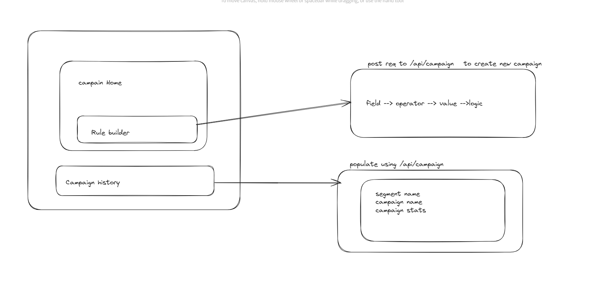
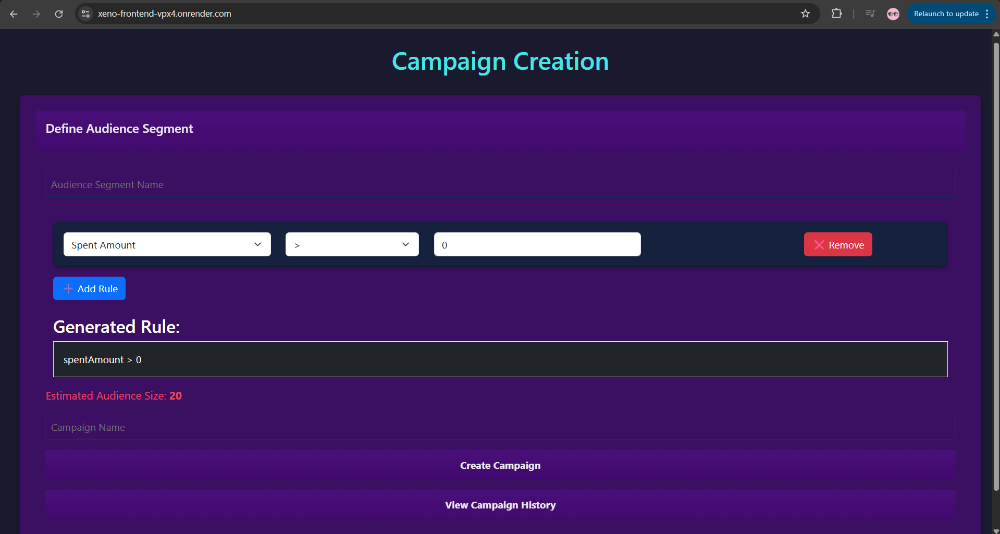
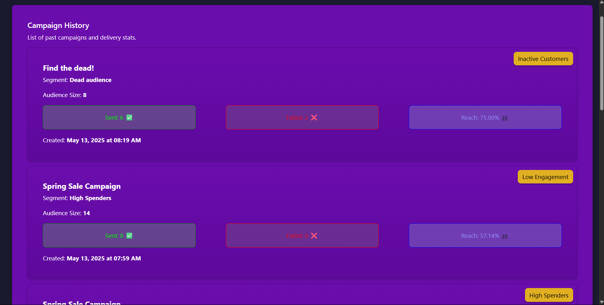

# Xeno Frontend

This is the frontend application for the Xeno project, built with React and Vite. It provides a user interface for managing campaigns, viewing campaign history, and other related features.

* Checkout Live here- https://xeno-frontend-vpx4.onrender.com/
* For testing purpose
* username : admin
* password: 123

* OR Login with google

## Features

* Protected routes
* Google OAuth implemented
* Campaign History
* Flexible Rule Builder
* Preview audience size
* Auto generated tag using AI
* Recent campaign at top


## Project Structure
```
- components
  - src
    - App.jsx
    - App.scss
    - assets/
    - components/
      - auth/                 #authentication based components
        - Callback.jsx
        - Login.jsx
        - LoginButton.jsx
        - ProtectedRoute.jsx
        - Register.jsx
      - CampaignHistory.jsx     
      - CampaignHome.jsx
      - RuleBuilder.jsx
    - Context/
      - CampaignContext.jsx       #global state management
    - index.css
    - main.jsx
    - utils/
      - fetchFunction.js          #common functions like fetching data

```


## Installation

1. Clone the repository:
```sh
git clone https://github.com/yogesh2i/xeno_frontend.git
cd xeno_frontend
```

2. Install dependencies:
```sh
npm install
```

3. Environment variables:
```sh
VITE_GOOGLE_CLIENT_ID= your_google_client_id
VITE_API_BASE_URL= your_backend_url (e.g: http://localhost:5000/api)
VITE_REDIRECT_URI= your_google_redirect_url
```

4. Start:
```sh
npm run dev
```

5. Open application at http://localhost:5173

## Images





